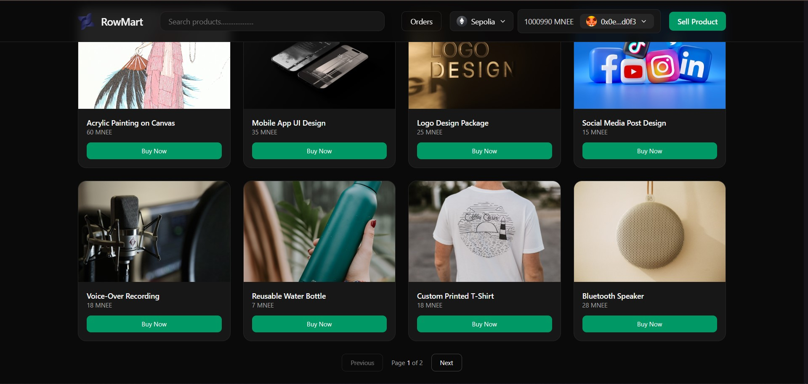

#  Rowmart



Rowmart is a decentralized Web3 marketplace that enables creators and sellers to list products, while buyers securely make purchases using the **`MNEE stablecoin`** through blockchain-powered smart contracts. It combines a modern Web2 user experience with trustless Web3 payments, escrow, and dispute-friendly workflows.

Rowmart is designed to be secure, transparent, and creator-friendly, eliminating unnecessary intermediaries while still delivering a smooth and intuitive user experience.

## Table of Content
- [ Rowmart](#-rowmart)
  - [Table of Content](#table-of-content)
  - [🌐 Live Demo \& Resources](#-live-demo--resources)
  - [🖼️ Preview](#️-preview)
  - [🧠 How Rowmart Works](#-how-rowmart-works)
  - [🏗️ Project Architecture](#️-project-architecture)
  - [🧩 Core Components](#-core-components)
    - [🖥️ Frontend](#️-frontend)
    - [🔗 Smart Contracts](#-smart-contracts)
    - [⚙️ Backend](#️-backend)
  - [🛠️ Tech Stack](#️-tech-stack)
  - [🚀 Getting Started](#-getting-started)
  - [📚 Documentation](#-documentation)
  - [🤝 Contributing](#-contributing)
- [📜 License](#-license)

## 🌐 Live Demo & Resources

[](https://rowmart.vercel.app)  
[](http://sepolia.etherscan.io/address/0x92CA87E1C9b1FbcB18039FEd44Ab7c490AF9C844)  
[](https://etherscan.io/address/0x8ccedbAe4916b79da7F3F612EfB2EB93A2bFD6cF#code)  
[](http://sepolia.etherscan.io/address/0x6247E28B65fFDd7e75823F0b580919dB8B01B0c6)  
<!-- [](https://youtube.com/watch?v=YOUR_VIDEO_ID)   -->

⚠️ **Note:** This project is currently deployed on **testnet** for development and testing purposes.


## 🖼️ Preview

| Homepage | Product Page | Buy Product| Orders & Escrow | 
|----------|--------------|------------|----------------|
|  |  |  | |


<!-- ## 🎥 Video Demo

[](https://youtube.com/watch?v=YOUR_VIDEO_ID) -->

---

## 🧠 How Rowmart Works

1. Sellers list products **on-chain**  
2. Buyers purchase using their **wallet**  
3. Funds are held securely via **smart contracts**  
4. Backend synchronizes **blockchain events**  
5. **Disputes** can be resolved transparently  
6. Sellers receive **payouts** after successful completion  

---

## 🏗️ Project Architecture
```bash
rowmart/
├── frontend/ # Web application (UI / UX)
├── backend/ # API & off-chain services
├── contracts/ # Smart contracts (Hardhat)
└── README.md
```


---

## 🧩 Core Components

### 🖥️ Frontend
- Web3-enabled marketplace UI  
- Wallet connection & transaction signing  
- Product listings, orders, ratings, and reviews  
- Built for speed and usability  

### 🔗 Smart Contracts
- Written in **Solidity** using Hardhat  
- Handles:  
  - Product creation  
  - Purchasing & escrow  
  - Order lifecycle  

### ⚙️ Backend
- Off-chain logic & API services  
- Email notifications  
- Improves performance and UX  

---

## 🛠️ Tech Stack

**Frontend**  
[](https://reactjs.org)  
[](https://vitejs.dev)  
[](https://tailwindcss.com)  
[](https://wagmi.sh/)  
[](http://viem.sh/docs/)

**Backend**  
[](https://nodejs.org)  
[](https://www.fastify.io/)  
[](https://www.mongodb.com)  
[](https://docs.ethers.io/)

**Smart Contracts**  
[](https://soliditylang.org)  
[](https://hardhat.org)  
[](https://openzeppelin.com/)

---

## 🚀 Getting Started

```bash
git clone https://github.com/GoldenThrust/rowmart
cd rowmart

npm run dev:server
npm run dev:client
```
> Each folder contains its own setup instructions.

## 📚 Documentation

- Frontend documentation → [frontend/README.md](/frontend/README.md)

- Backend documentation → [backend/README.md](/backend/README.md)

- Smart contract documentation → [contracts/README.md](/contracts/README.md)

## 🤝 Contributing

Contributions, issues, and feature requests are welcome:

1. Fork the repository

2. Create a new branch

3. Commit your changes

4. Open a pull request

# 📜 License

This project is licensed under the MIT License.